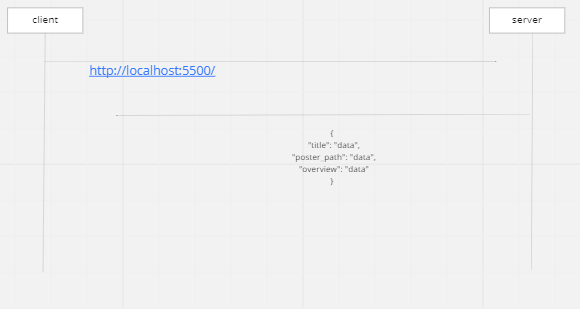
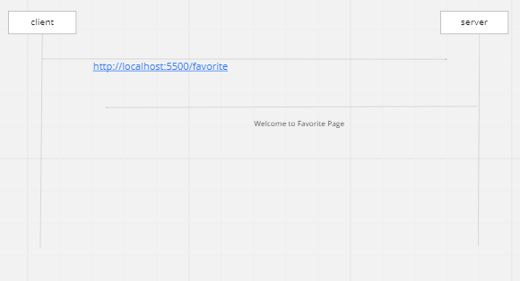
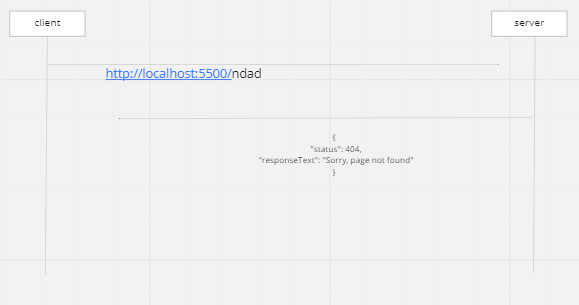
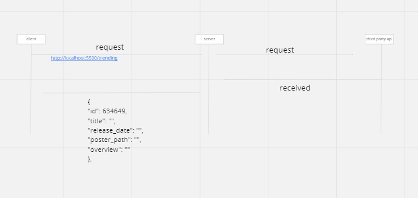
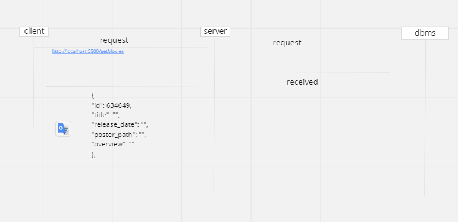
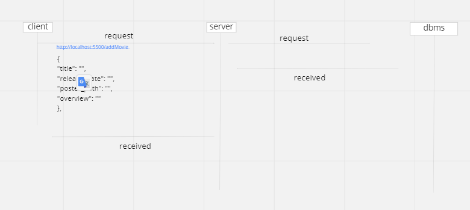

# Movies Library - Version 1

**Author Name** : Rami Ghanem

## WRRC

### Home Page Get (localhost:5500/) : 

### favorit (localhost:5500/favorit): 

### page not found (localhost:5500/...): 

### theard party api get (localhost:5500/trending,localhost:5500/search,localhost:5500/now_playing,localhost:5500/upcoming) : 

### get Movies (localhost:5500/getMovies) : 

### add Movie (localhost:5500/addMovie): 

## Overview

## Getting Started
<!-- What are the steps that a user must take in order to build this app on their own machine and get it running? -->

## Project Features
<!-- What are the features included in you app -->